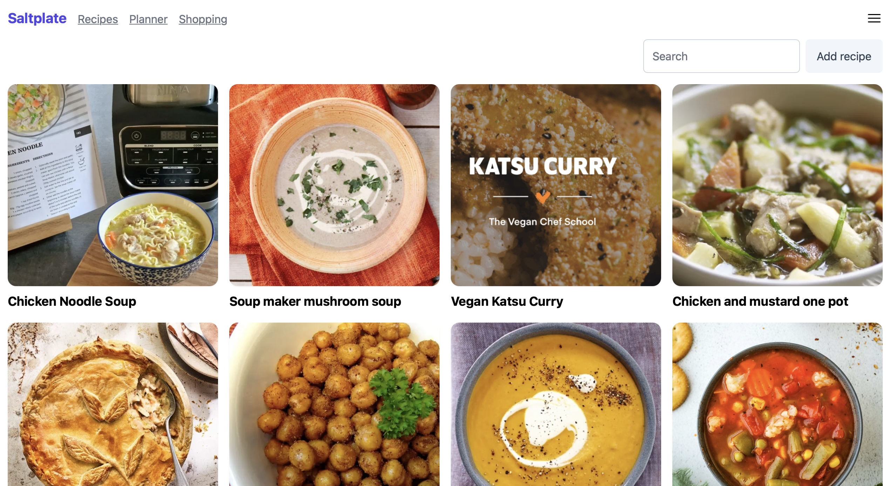
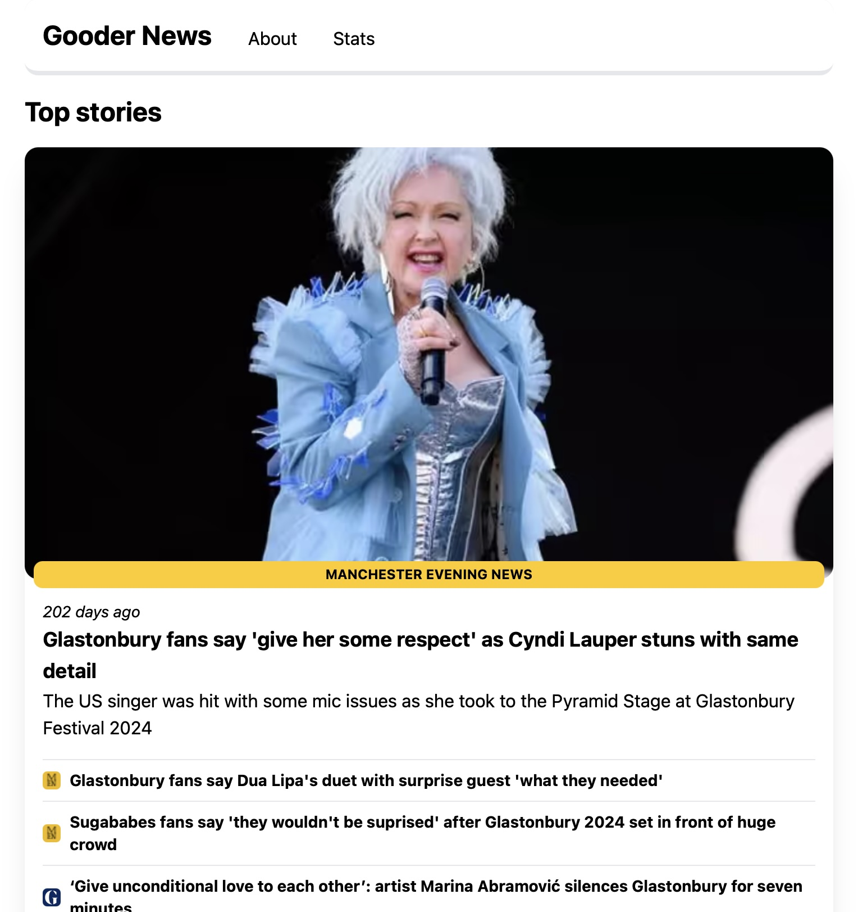

## Hi, I'm Duncan 👋

I'm a front-end developer based in Manchester, UK.

[Sometimes I help people code](./women-tech-makers.jpg).

Feel free to check out my [LinkedIn](https://www.linkedin.com/in/duncanwilder/).

Check out some of the stuff I've been playing around with in my pinned repositories 👇

### Other work

I'm not ready to share the source code for these, but here's some other things I've tinkered with.

#### Saltplate

Saltplate is a recipe management website I built. Add your own recipes to it, add them to a planner + scale them for how many each needs to feed, then add them to a smart shopping list, designed to make the weekly shop easy.

#### Gooder News

Gooder News is an AI-powered news aggregator that uses the latest AI features to filter and group positive news stories from mainstream UK publishers.

It’s easy to get bogged down in all the negativity that exists on the Internet. But there’s also a lot of positive news out there—it’s just harder to find.

There are sites like [Positive News](https://www.positive.news) that focus on positive stories, but they often don’t discuss current events such as general elections or football.

That’s where Gooder News comes in. See the latest news, without the negativity.

<!--
**DuncanWilder/DuncanWilder** is a ✨ _special_ ✨ repository because its `README.md` (this file) appears on your GitHub profile.

Here are some ideas to get you started:

- 🔭 I’m currently working on ...
- 🌱 I’m currently learning ...
- 👯 I’m looking to collaborate on ...
- 🤔 I’m looking for help with ...
- 💬 Ask me about ...
- 📫 How to reach me: ...
- 😄 Pronouns: ...
- ⚡ Fun fact: ...
-->
